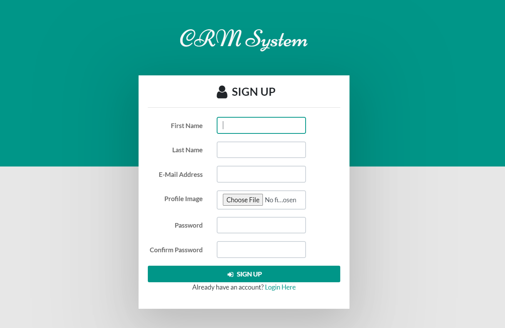
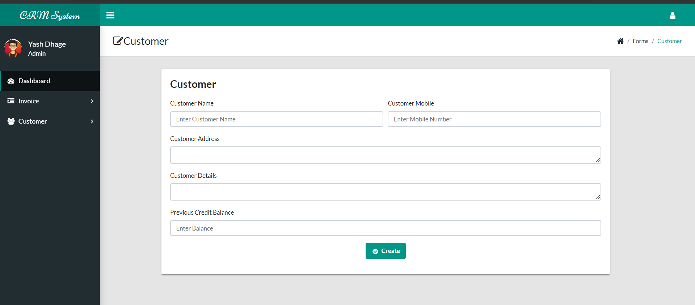

Customer Relation Management System (CRM)

This CRM system is designed to help manage customer information efficiently. Below are the modules and functionalities provided:

Modules:
        1. Login: Allows users to securely log into the system.
        2. Register: Enables new users to create an account.
        3. Edit Profile: Allows users to modify their profile information.
        4. Change Password: Provides functionality to change the user's password.
        5. Customer Details: Displays detailed information about customers.
        6. Category: 

Screenshots:

    

